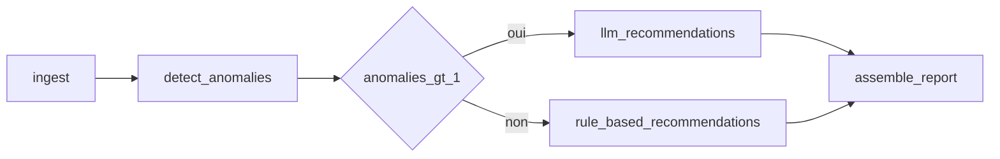

# Pipeline d’anomalies infrastructure (`devoteam-test`)

## Objectif

Application modulaire qui lit un fichier JSON de mesures techniques ([`rapport.json`](../rapport.json)), exécute pour **chaque ligne** un graphe **LangGraph**, détecte les anomalies selon des **seuils YAML**, puis produit des **recommandations** soit par **règles déterministes**, soit via un **LLM** (OpenRouter) lorsque **plus d’une anomalie** est détectée sur la même ligne.

## Flux



1. **ingest** : validation Pydantic d’une mesure (`MetricSnapshot`).
2. **detect** : comparaison aux seuils du fichier [`config/thresholds.yaml`](../config/thresholds.yaml) (métriques numériques + états de services).
3. **Routage** : si **plus d’une** anomalie est détectée sur la mesure → branche **LLM** ; sinon (0 ou 1 anomalie) → branche **règles** (voir [Recommandations](#recommandations)).
4. **LLM** : appel OpenAI-compatible vers `https://openrouter.ai/api/v1` ; la réponse est interprétée comme JSON (objet `summary` + `recommendations`, éventuellement dans un bloc Markdown). Si le parsing échoue ou si la clé API est absente, **repli** sur les règles déterministes.
5. **report** : construction d’un [`LineReport`](../src/devoteam_test/models/report.py) par ligne.
6. **CLI** : boucle sur tout le tableau JSON ; sortie agrégée [`AggregatedPipelineOutput`](../src/devoteam_test/models/report.py) : seules les **lignes avec au moins une anomalie** apparaissent dans `reports` (les mesures nominales sont traitées mais omises pour réduire le volume). Le champ `rows_analyzed` indique le nombre total de lignes lues.

## Recommandations

Après la détection d’anomalies, le pipeline doit proposer des **actions concrètes**. Deux modes de production coexistent, selon une **règle de routage explicite** :

La détection produit une **liste d’anomalies** par mesure (chaque dépassement de seuil configuré ou statut de service anormal y figure comme une entrée). Le routage des recommandations suit une logique volontairement **simple et auditable**.

### Cas « règles métier » : au plus une anomalie (0 ou 1 « seuil » franchi au sens métier)

Quand **aucune** anomalie n’est détectée, le rapport indique un état nominal. Quand **une seule** anomalie est détectée — par exemple un unique indicateur au-dessus du pli YAML, ou un seul service en état dégradé selon la configuration — les recommandations sont générées par des **règles métier déterministes** (templates et messages associés au type d’anomalie).

**Justification :**

- **Coût et latence** : pas d’appel externe au modèle ; exécution prévisible et rapide sur de gros volumes de mesures.
- **Traçabilité** : le lien entre l’anomalie détectée et la recommandation est direct, reproductible et revue de code possible sans dépendre d’un modèle probabiliste.
- **Adéquation opérationnelle** : un signal isolé correspond souvent à des **playbooks** connus (surveiller une métrique, investiguer un service nommé, envisager un scale-out ciblé). Les règles codifient ces réponses standard sans sur-ingénierie.

### Cas « LLM » : plusieurs anomalies sur la même mesure

Dès que **plus d’une** anomalie est détectée sur **la même ligne** (plusieurs seuils dépassés, ou combinaison métriques + services, etc.), le pipeline envoie le contexte (métriques + liste d’anomalies) à un **LLM** via OpenRouter.

**Justification :**

- **Synthèse multi-signaux** : plusieurs dépassements peuvent être **corrélés** (charge CPU élevée + latence + service dégradé). Un modèle de langage peut proposer une lecture d’ensemble et des actions **ordonnées** plutôt qu’une juxtaposition de messages génériques.
- **Priorisation** : le LLM peut mettre en avant les actions les plus urgentes quand les symptômes se recouvrent ou se contredisent partiellement.
- **Formulation contextuelle** : la sortie reste structurée (`summary`, `recommendations`) pour consommation automatique ou humaine, tout en restant adaptée au lot d’anomalies observé.

En résumé : **une anomalie isolée** → réponse **réglementée par les règles YAML + logique déterministe** ; **plusieurs anomalies simultanées** → **appel LLM** pour une recommandation consolidée, avec repli sur les règles si l’API ou le parsing échoue.

## Configuration des seuils (YAML)

Fichier par défaut : `config/thresholds.yaml` (surcharge via `THRESHOLDS_PATH`).

- **`numeric`** : pour chaque clé correspondant à un champ numérique de la mesure, un couple `max` / `severity`. Une anomalie est levée si la valeur est **strictement supérieure** à `max`. Les clés absentes du YAML ne sont pas évaluées.
- **`services.status_severity`** : pour chaque état de service (`degraded`, `offline`, …) listé, une anomalie est levée pour chaque service du champ `service_status` dont la valeur correspond, avec la criticité indiquée.

Les seuils ne sont pas codés en dur dans le code : seule la sémantique « comparer au dessus du max » et « traiter certains statuts comme anomalies » est implémentée.

## Variables d’environnement (OpenRouter)

| Variable | Rôle |
|----------|------|
| `OPENROUTER_API_KEY` | Clé API OpenRouter ; sans elle, le nœud LLM se replie sur les règles. |
| `OPENROUTER_MODEL` | Modèle routeur (ex. `openai/gpt-4o-mini`). |

Copier [`.env.example`](../.env.example) vers `.env` et renseigner les valeurs. La CLI charge `.env` via `python-dotenv`.

## Format de sortie JSON

Racine :

- **`rows_analyzed`** : nombre total de mesures lues dans le fichier d’entrée.
- **`reports`** : uniquement les mesures ayant **au moins une anomalie** ; chaque objet contient `timestamp`, `anomalies`, `recommendations` (jeu **effectif** : règles si branche règles ou repli, sinon sortie LLM), **`rule_based_recommendations`** (toujours les recommandations **déterministes** dérivées des anomalies, y compris quand le LLM a été appelé — pour comparaison et traçabilité), `summary`, `recommendation_source` (`llm` \| `rules` \| `none`).
- **`global_summary`** : synthèse (lignes lues vs lignes avec anomalie, anomalies cumulées, passages LLM — en repli, la source reste `rules`).

## Exécution

Prérequis : [uv](https://docs.astral.sh/uv/), **Python 3.12.x** (voir [`pyproject.toml`](../pyproject.toml) et [`.python-version`](../.python-version)), dépendances installées.

```bash
uv sync --all-groups
uv run devoteam-pipeline
```

Chemins optionnels :

- `RAPPORT_PATH` : fichier JSON entrée (défaut : `rapport.json` à la racine du répertoire courant).
- `THRESHOLDS_PATH` : fichier YAML des seuils (défaut : `config/thresholds.yaml`).
- `OUTPUT_PATH` : fichier JSON de sortie. Si la variable n’est pas définie, le rapport est écrit dans `output.json` (répertoire courant). Les répertoires parents sont créés si besoin. La valeur `-` force l’écriture sur **stdout** (utile pour un pipe).

Les commandes équivalentes sont regroupées dans le [Makefile](../Makefile) : `make help`.

## Qualité de code

| Outil | Commande |
|-------|----------|
| Ruff (lint) | `make lint` ou `uv run ruff check src` |
| Ruff (format) | `make format` ou `uv run ruff format src` |
| ty | `make typecheck` ou `uv run ty check src` |
| Les deux | `make check` |

## Commits

Messages au format [Conventional Commits](https://www.conventionalcommits.org/) : `type(scope optionnel): description` (ex. `feat(graph): add conditional routing`, `docs: describe YAML thresholds`).
