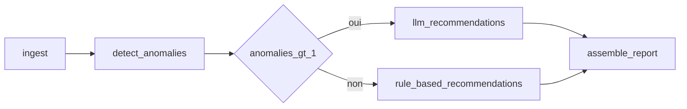

# Pipeline d’anomalies infrastructure (`devoteam-test`)

## Objectif

Application modulaire qui lit un fichier JSON de mesures techniques ([`rapport.json`](../rapport.json)), exécute pour **chaque ligne** un graphe **LangGraph**, détecte les anomalies selon des **seuils YAML**, puis produit des **recommandations** soit par **règles déterministes**, soit via un **LLM** (OpenRouter) lorsque **plus d’une anomalie** est détectée sur la même ligne.

## Flux



1. **ingest** : validation Pydantic d’une mesure (`MetricSnapshot`).
2. **detect** : comparaison aux seuils du fichier [`config/thresholds.yaml`](../config/thresholds.yaml) (métriques numériques + états de services).
3. **Routage** : si `len(anomalies) > 1` → branche **LLM** ; sinon → branche **règles**.
4. **LLM** : appel OpenAI-compatible vers `https://openrouter.ai/api/v1` avec sortie structurée (résumé + liste d’actions). Si la clé API est absente ou en cas d’erreur, **repli automatique** sur les mêmes règles que la branche « règles ».
5. **report** : construction d’un [`LineReport`](../src/devoteam_test/models/report.py) par ligne.
6. **CLI** : boucle sur tout le tableau JSON ; sortie agrégée [`AggregatedPipelineOutput`](../src/devoteam_test/models/report.py) (liste de rapports + `global_summary`).

## Configuration des seuils (YAML)

Fichier par défaut : `config/thresholds.yaml` (surcharge via `THRESHOLDS_PATH`).

- **`numeric`** : pour chaque clé correspondant à un champ numérique de la mesure, un couple `max` / `severity`. Une anomalie est levée si la valeur est **strictement supérieure** à `max`. Les clés absentes du YAML ne sont pas évaluées.
- **`services.status_severity`** : pour chaque état de service (`degraded`, `offline`, …) listé, une anomalie est levée pour chaque service du champ `service_status` dont la valeur correspond, avec la criticité indiquée.

Les seuils ne sont pas codés en dur dans le code : seule la sémantique « comparer au dessus du max » et « traiter certains statuts comme anomalies » est implémentée.

## Variables d’environnement (OpenRouter)

| Variable | Rôle |
|----------|------|
| `OPENROUTER_API_KEY` | Clé API OpenRouter ; sans elle, le nœud LLM se replie sur les règles. |
| `OPENROUTER_MODEL` | Modèle routeur (ex. `openai/gpt-4o-mini`). |

Copier [`.env.example`](../.env.example) vers `.env` et renseigner les valeurs. La CLI charge `.env` via `python-dotenv`.

## Format de sortie JSON

Racine :

- **`reports`** : liste d’objets par mesure, avec `timestamp`, `anomalies` (liste avec `code`, `message`, `severity`, `field`), `recommendations`, `summary`, `recommendation_source` (`llm` \| `rules` \| `none`).
- **`global_summary`** : synthèse sur l’ensemble du fichier (nombre de mesures, anomalies cumulées, lignes avec recommandations **effectivement** produites par le LLM — en repli, la source reste `rules`).

## Exécution

Prérequis : [uv](https://docs.astral.sh/uv/), dépendances installées.

```bash
uv sync --all-groups
uv run devoteam-pipeline
```

Chemins optionnels :

- `RAPPORT_PATH` : fichier JSON entrée (défaut : `rapport.json` à la racine du répertoire courant).
- `THRESHOLDS_PATH` : fichier YAML des seuils (défaut : `config/thresholds.yaml`).

Les commandes équivalentes sont regroupées dans le [Makefile](../Makefile) : `make help`.

## Qualité de code

| Outil | Commande |
|-------|----------|
| Ruff (lint) | `make lint` ou `uv run ruff check src` |
| Ruff (format) | `make format` ou `uv run ruff format src` |
| ty | `make typecheck` ou `uv run ty check src` |
| Les deux | `make check` |

## Commits

Messages au format [Conventional Commits](https://www.conventionalcommits.org/) : `type(scope optionnel): description` (ex. `feat(graph): add conditional routing`, `docs: describe YAML thresholds`).
